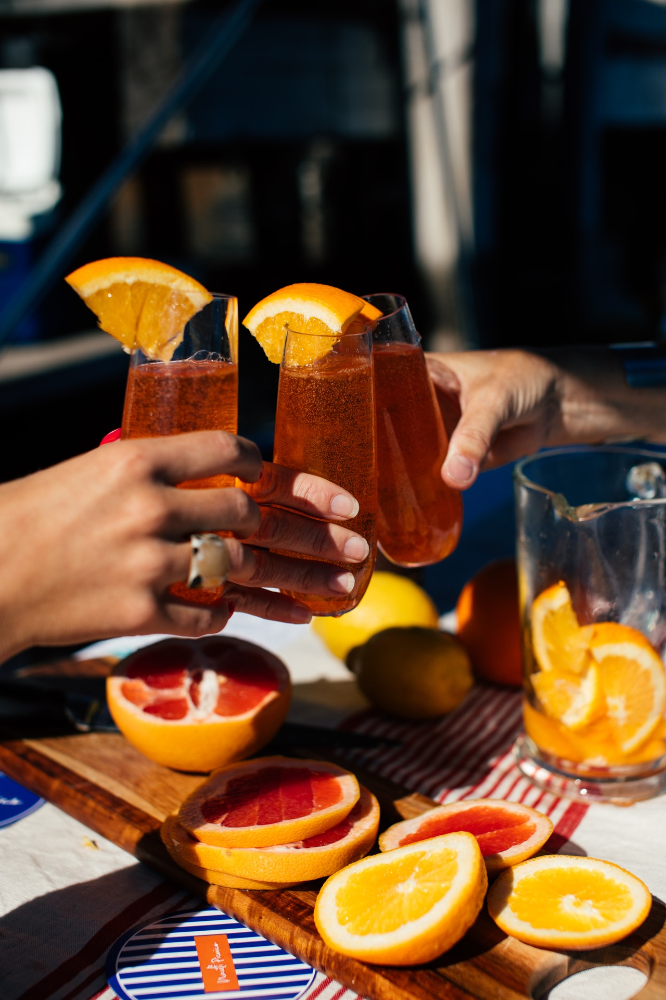

```{r setup, include = FALSE}

options(htmltools.dir.version = FALSE)
# knitr::opts_chunk$set(echo = FALSE, warning = FALSE, message = FALSE, comment = "")
knitr::opts_chunk$set(echo = FALSE, comment = "")
library(gifski)
# knitr::opts_knit$set(animation.fun = hook_gifski)
xaringanthemer::style_mono_accent(title_slide_background_color = "#EDF4FB",
                                  title_slide_text_color = "#000000",
                                  base_font_size = "18px")
Sys.setenv(LANG = "en")

library(knitr)

```

# How It Started


```{r, out.width = "30%", out.height = "30%", fig.align = "center"}

# knitr::include_graphics("libs/_Images/pexels-olia-danilevich-8145365.jpg")
```


???

So I went to that party. The first person that caught my attention was a beautiful lady. Attractive, yes, but it was more than that: she seemed like a very interesting character. I really wanted to get to know her better, but I was a bit shy.

She had a laptop on her lap (where else) and seemed to be focused on it.

---

# How It Started

<br><br><br>

```{r, out.width = "207px", out.height = "240px", fig.show = "hold"}
# aspect ratio: 240 x 278
include_graphics("libs/_Images/logo_dplyr.png")
include_graphics("libs/_Images/logo_tidyverse.png")
include_graphics("libs/_Images/logo_tibble.png")
include_graphics("libs/_Images/logo_magrittr.png")
include_graphics("libs/_Images/logo_forcats.png")

```

```{r, animation.hook='gifski'}
# This works!
# for (i in 0:1) {
#   pie(c(i, 6), col = c('red', 'yellow'), labels = NA)
# }
```

???

After watching her for a mere 30 minutes, very unobtrusively of course, I dared to get a bit closer.

I was pleasantly surprised to see some familiar hex stickers on her machine.

Gaining a bit of confidence, I managed to smile, and mumbled:

"Ah, I see you like modern art (René Magritte) and cats! So do I."

I was lucky: She smiled back, and calmly asked: "So you're into R?"

I swalled nervously, then nodded.

"Got some tricks to entertain me?" she asked teasingly.

"I know a bit of history", I replied. "Not the boring stuff from school. Mind if I type a few lines of code?"

She got curious, and willingly gave me access to the laptop.

---

# Some History ...

.pull-left[
```{r leaflet, echo = TRUE, eval = FALSE}
library(leaflet)
leaflet() %>% 
  addTiles() %>% 
  addMarkers(lng=174.768, lat=-36.852, 
    popup="R was born here in 08/1993!")

```
]

--

.pull-right[
```{r, ref.label = "leaflet"}
```

]

???

She zoomed in and out a bit, but wasn't too impressed. "So you read leaflet's help page. Well done. I just hope that isn't all."

"Fine", I sighed. "I don't want to get too personal too quickly. So let's stay object oriented for the time being. How about the following code?"

---

# Can We Have a Date, Please?

```{r, echo = TRUE}

num <- 1645563742
class(num)

```

???

"What is this about?"

"Life is not just about numbers. I want this to be a romantic date.", I said, and looked her straight in the eyes.

--

```{r date, echo = TRUE, eval = FALSE}
class(num) <- "POSIXct" #<<
num
```

???

"See - that's both the danger and beauty of Base R's S3 system. You can arbitrarily change object classes."

Now she ***was*** impressed, at least a bit.

--

```{r, ref.label = "date"}
```


---


# What Guys Are Missing

```{r, fig.align = "center"}
include_graphics("https://media.giphy.com/media/dszhf8CNNLUOXXBhdH/giphy.gif")
```

.center[via **giphy.com**: "I Can Feel It Agents Of Shield GIF By ABC Network"]

???

"Well", she said, "I see you have some intuition for numbers. Fine. But can you match mine?"

I had no idea what she was up to.

"My experience is that guys may be genius at solving logical tasks, but tend to be somewhat less gifted when it comes to numerical intuition."

"Can you be more specific about how that intuition for numbers comes into play?" I asked.

She was straight to the point: "Sure. Watch. What do you think this code will produce?"

---

# Magic Numbers

.pull-left[
```{r magic1, echo = TRUE, eval = FALSE}
set.seed(17)  #<<
one <- sample(letters, size = 1)

set.seed(1750)  #<<
two <- sample(letters, size = 3,
              replace = TRUE) |>
  paste(collapse = "")

set.seed(8661721)  #<<
three <- sample(letters, size = 5,
                replace = TRUE) |>
  paste(collapse = "")

paste(one, two, three) |>
  stringr::str_to_title()
```

]

--

```{r, ref.label = "magic1"}
```

???

"No idea", I said.

"Exactly. Because you have no intuition of numbers."

I was stunned.

"Your turn!" She looked at me, triumphantly. "Come up with something, cowboy!" she teased.

I needed to gain time.

"I saw that forcats sticker. So you like cats. That's something we have in common. I know how to make cats purr. Or, rather, how to make R purrr. Does that count?"

"Show me" - she was as direct as ever.

"What if your intuition leads to longer sentences? Surely you wouldn't *copy & paste* `set.seed(magicnumber)` and `sample()` all the time?"

She hesitated, then quickly said: "Of course I'd write a function."

"Sure", I smiled, gaining a bit of confidence back.
"But have you ever iterated over several vectors at once?"

She was honest enough to shake her head. This was my chance.

"Let's start with the function." I needed to type quickly to make an impression.

---

# Know Your Pets - Make R purrr

```{r magic-message, echo = TRUE}
magic_message <- function(seed, word_length) {
  set.seed(seed)
  sample(letters, size = word_length,  replace = TRUE) |>
    paste(collapse = "") |>
    stringr::str_to_title()
}

```

--

.pull-left[
```{r purrr, echo = TRUE, eval = FALSE}
seeds <- c(208710, 1982138, 942538)
word_lengths <- rep(4, 3)
purrr::map2_chr(seeds,  #<<
                word_lengths, 
                magic_message) |>
  cat()
```

]

???

"So how can we apply that function elegantly?"

Before I could copy her magic seeds, she stunned me by quickly giving me new ones.

--

.pull-right[
```{r, ref.label = "purrr"}
```

]

???

"Need More Data? So you want to get to know me better?"

My heart melted when she just smiled.

"Oh, I need to go to the bathroom for a moment. I'll be right back", she quipped.

This was another chance! I needed to be really quick.

This is what I came up with. I went all in.

---

# A Happy Ending

.pull-left[
```{r our-year, echo = TRUE, eval = FALSE}

magic_message <- function(seed,
                 choices, #<<
                 word_length) {
  set.seed(seed)
  sample(choices, size = word_length, 
         replace = TRUE) |>
    paste(collapse = "") |>
    stringr::str_to_title()
}

seeds <- c(99467, 395, 571205,
           9487, 12264, 443238)
choices <- c(rep(list(letters), 3), 
             list(0:9), rep(list(letters), 2))
word_lengths <- c(3, 2, 4, 4, 3, 4)

purrr::pmap_chr(   #<<
  list(seeds, choices, word_lengths), #<<
  magic_message) |>
cat()

```

]

--

.pull-right[
```{r, ref.label = "our-year"}
```

```{r}
include_graphics("libs/_Images/logo_purrr.png")
```

]

???

"I suppose you haven't used `pmap_chr()` before?"

She tried to keep cool: "No, but nevermind. You are at least somewhat romantic, not only rational, but also intuitive, and you love cats."

"So we'll have another date?"

"I hope it will be more than one!"

---

# The End

```{r, fig.align = "center"}
include_graphics("https://media.giphy.com/media/HCkrFnSP5d7Ta/giphy.gif")
```

.center[via **giphy.com:** Silent Film Flirt GIF]

---

class: center, middle

# Thanks!

### Youtube: StatistikinDD

### Twitter: @StatistikinDD

### github: fjodor

Slides created via the R package [**xaringan**](https://github.com/yihui/xaringan).

The chakra comes from [remark.js](https://remarkjs.com), [**knitr**](https://yihui.org/knitr), and [R Markdown](https://rmarkdown.rstudio.com).

Thanks to **Yihui Xie** for *{knitr}* and *{xaringan}* and **Garrick Aden-Buie** for *{xaringanthemer}*.