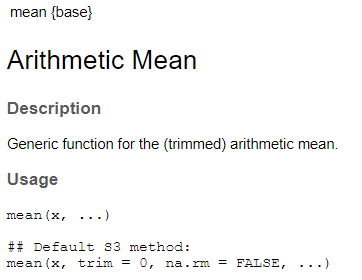
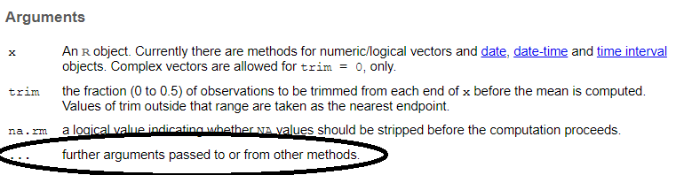
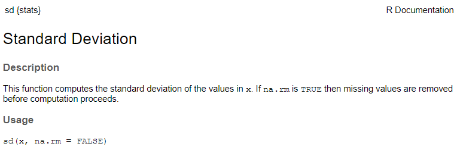

```{r setup, include = FALSE}

options(htmltools.dir.version = FALSE)
# knitr::opts_chunk$set(echo = FALSE, warning = FALSE, message = FALSE, comment = "")
knitr::opts_chunk$set(echo = TRUE, comment = "")
Sys.setenv(LANG = "en")

```

# The "..." in R Functions

### Ever stumbled across the "..." in R Functions?

```{r help-mean, eval = FALSE}

?mean

```

--



---

# The "..." in R Functions

### Ever stumbled across the "..." in R Functions?

```{r, ref.label = "help-mean", eval = FALSE}
```



---

# Let's Get Practical

## A Simple Use Case

```{r minmax}

minmax <- function(x) {
  min <- min(x)
  max <- max(x)
  c(Min = min, Max = max)
}

minmax(1:10)

```

---

# How About Missing Values?

```{r missings}

minmax(c(1:9, NA))

```

--

```{r missings2, error = TRUE}

minmax(c(1:9, NA), na.rm = TRUE)

```

---

# How About Missing Values?

## Extending Our Function

```{r}

minmax <- function(x, na.rm = FALSE) {
  min <- min(x, na.rm = na.rm)
  max <- max(x, na.rm = na.rm)
  c(Min = min, Max = max)
}

minmax(c(1:9, NA))

minmax(c(1:9, NA), na.rm = TRUE)

```

--

* Violation of DRY principle: **D**on't **R**epeat **Y**ourself;  
  code contains redundancy using `na.rm = na.rm` twice
* What if we had 10 instead of 2 calculations inside the function?

---

# The dot dot dot Magic

```{r}

minmax <- function(x, ...) {
  min <- min(x, ...)
  max <- max(x, ...)
  c(Min = min, Max = max)
}

minmax(c(1:9, NA))

minmax(c(1:9, NA), na.rm = TRUE)

```

---

# So Where is the Danger?


```{r}

minmax <- function(x, ...) {
  min <- min(x, ...)
  max <- max(x, ...)
  c(Min = min, Max = max)
}

minmax(c(1:9, NA), na.mr = TRUE) #<<

```

--

```{r, error = TRUE}

minmax <- function(x, na.rm = FALSE) {
  min <- min(x, na.rm = na.rm)
  max <- max(x, na.rm = na.rm)
  c(Min = min, Max = max)
}

minmax(c(1:9, NA), na.mr = TRUE) #<<

```

---

# Last But Not Least: More Calculations

```{r, error = TRUE}

my_stats <- function(x, ...) {
  min <- min(x, ...)
  mean <- mean(x, ...)
  sd <- sd(x, ...)
  max <- max(x, ...)
  c(Min = min, Avg = mean, SD = sd, Max = max)
}

my_stats(c(1:9, NA), na.mr = TRUE) #<<

```

---

# Last But Not Least: More Calculations

```{r, eval = FALSE}

?sd

```



---

class: center, middle

# Thanks!

### Youtube: StatistikinDD

### Twitter: @StatistikinDD

### github: fjodor

Slides created via the R package [**xaringan**](https://github.com/yihui/xaringan).

The chakra comes from [remark.js](https://remarkjs.com), [**knitr**](https://yihui.org/knitr), and [R Markdown](https://rmarkdown.rstudio.com).

Thanks to **Yihui Xie** for *{knitr}* and *{xaringan}* and **Garrick Aden-Buie** for *{xaringanthemer}*.